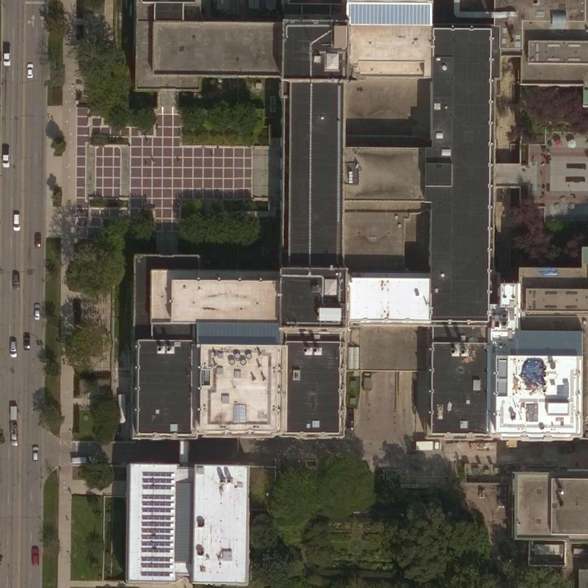

# Geospatial Assigment5: Satellite/Aerial Image Retrieval

<p align=center>
    Qinglin Li,  
    Weiyi Zeng, 
    Shu Dong
</p>

First, make sure you have `Python2`, `numpy` and the Python interface of `OpenCV` installed.

Then, run `query.py` to get the aerial image within the bounding box.

```
python query.py lat1 lon1 lat2 lon2 save_image_name
```

For example, you can get the aerial image of Technological Institute by the following command

```
python query.py 42.057000 -87.674883 42.058500 -87.676883 tech.jpg
```

It should give you the image of Tech in `tech.jpg`

